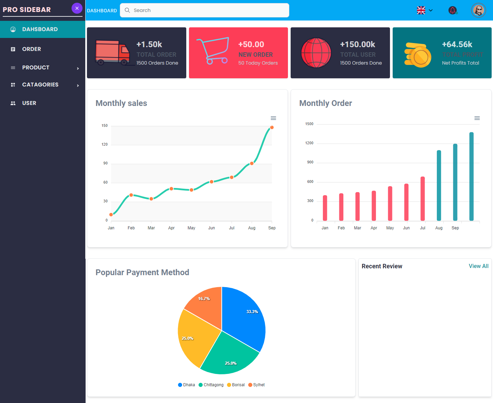
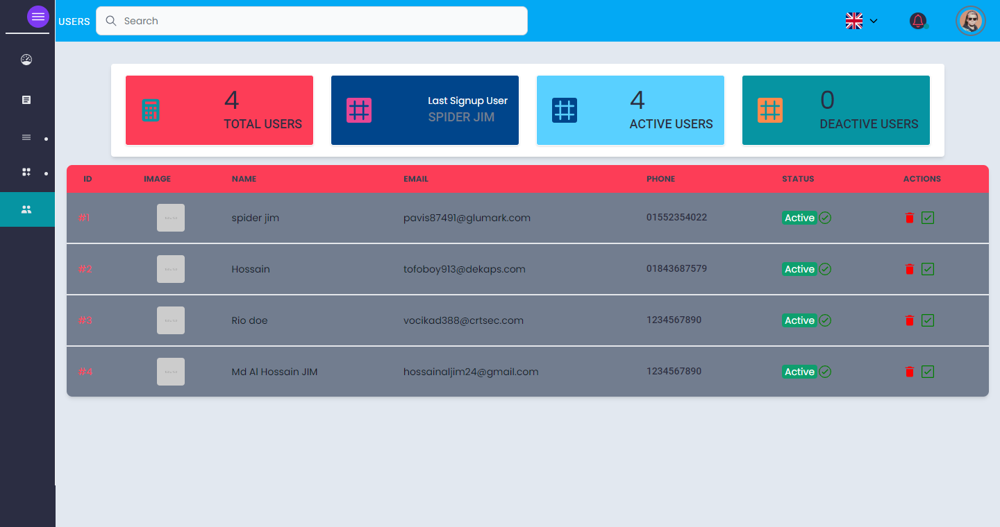

# EASY-SHOP 
 

## This a Full stack  E-commerce Project with Mobile Application.

### `Frontend Website`
[website](https://easyshopjim.netlify.app/)

### `Admin Panel`
[Admin](https://easyshopadminjim.netlify.app/)
-------------------------------

<table style="padding:10px">
  <tr>
    <td> 
        
Signup Page

        
    </td>      
    <td>
        
Login Page

        
    </td>
    <td>
        
Forgot Password

        
    </td>
    <td>
        
Otp Page

        
    </td>
  </tr>

  <tr>
    <td>
        
reset Password

        
    </td>
    <td>
        
Home Page

        
    </td>
    <td>
        
Shop Page

        
    </td>
    <td>
        
Product Details Page

        
    </td>
  </tr>

  <tr>
    <td>
        
About Page

        
    </td>
    <td>
        
Contact Page

        
    </td>
    <td>
        
Search Page

        
    </td>
    <td>
        
Wishlist Page

        
    </td>
  </tr>
  <tr>
    <td>
        
Cart Page

        
    </td>
    <td>
        
Checkout Page

        
    </td>
    <td>
        
Payment Stripe Page

        
    </td>
    <td>
        
Cash On Page

        
    </td>
  </tr>
  <tr>
    <td>
        
Cart Mobile View

        
    </td>
    <td>
        
Shop Mobile View

        
    </td>
    <td>
        
Home Mobile View

        
    </td>
    <td>
        
Search Mobile View

        
    </td>
  </tr>

</table>

### `Admin Panel`
[Admin](https://easyshopadminjim.netlify.app/)

<table style="padding:10px">

  <tr>
    <td> 
        
Admin

        
    </td>      
    <td>
        
Product Page

        
    </td>
    <td>
        
Add new Product

        
    </td>
    <td>
        
User Page

        
    </td>
  </tr>
 
 <tr>
    <td> 
        
Catagori

        
    </td>      
    <td>
        
Add New Catagori

        
    </td>
    <td>
        
Catagori base Product

        
    </td>
    <td>
        
Product Details 

        
    </td>
  </tr>
 
  <tr>
    <td> 
        
Order

        
    </td>      
    <td>
        
Order Detials

        
    </td>
    <td>
        
Confirm Order

        
    </td>
    <td>
        
Login Admin 

        
    </td>
  </tr>

</table>